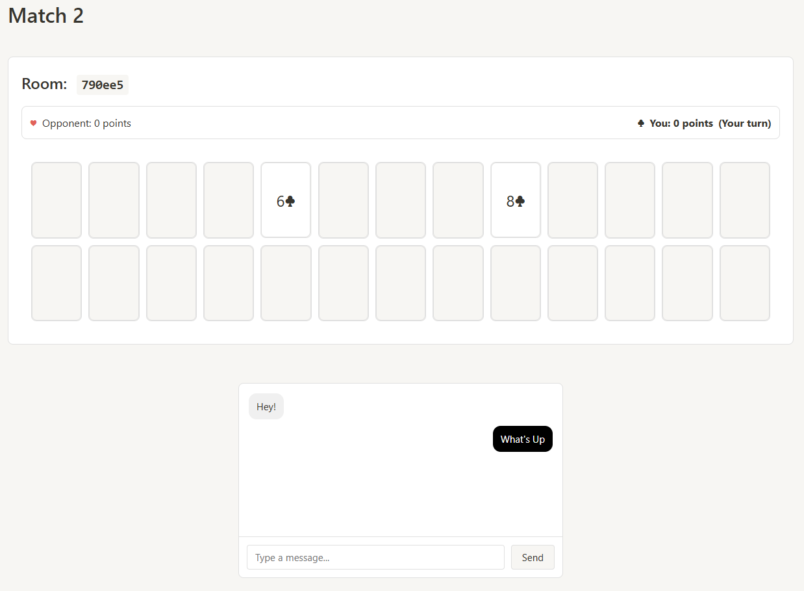

# Match 2 - Multiplayer Card Memory Game 🃏

A real-time multiplayer memory card matching game built with React and Socket.IO. Players take turns flipping cards and matching pairs, competing to find the most matches.

 <!-- You should add a screenshot of your game -->

## 🎮 Game Features

- **Real-time Multiplayer**: Play with friends in real-time
- **Custom Suit Selection**: Each player chooses their suit color
- **Live Chat**: Built-in chat system to communicate with your opponent
- **Room System**: Create or join game rooms with unique IDs
- **Score Tracking**: Keep track of matches and determine the winner
- **Responsive Design**: Play on any device

## 🚀 Live Demo

Try the game: [Match 2 on Render](https://match2.onrender.com)

## 🛠️ Tech Stack

- **Frontend**: React, Vite
- **Backend**: Node.js, Express
- **Real-time Communication**: Socket.IO
- **Deployment**: Render

## 📋 Prerequisites

- Node.js (v18 or higher)
- npm (v8 or higher)

## 🔧 Installation

1. Clone the repository
bash
git clone https://github.com/your-username/match2.git
cd match2
2. Install dependencies
bash
npm install
3. Start the development servers

For the backend:
bash
npm run dev:server

For the frontend:
bash
npm run dev:client

4. Open [http://localhost:5173](http://localhost:5173) in your browser

## 🎯 How to Play

1. **Create or Join a Room**
   - Create a new game room
   - Share the room ID with a friend
   - Wait for your opponent to join

2. **Select Your Suit**
   - Each player chooses their preferred suit (hearts, diamonds, clubs, or spades)
   - The game begins after both players have selected

3. **Match Cards**
   - Take turns flipping two cards
   - Match cards with the same value but different suits
   - Score points for each successful match

4. **Win the Game**
   - Player with the most matches wins
   - Use the chat to communicate with your opponent
   - Click "Play Again" for a rematch

## 💻 Development

### Available Scripts

- `npm run dev:server` - Start the development server
- `npm run dev:client` - Start the Vite development server
- `npm run build` - Build the production version
- `npm run start:prod` - Start the production server

### Project Structure

match2/
├── server/
│ └── server.js
├── src/
│ ├── components/
│ │ ├── Card.jsx
│ │ ├── GameBoard.jsx
│ │ ├── Room.jsx
│ │ └── ...
│ ├── App.jsx
│ └── index.jsx
├── public/
└── package.json

Made with ❤️ by YY
